

<h1><strong>ReDenim - Vintage Denim Store</strong></h1>

*A Static Website displaying the use of HTML&CSS - [live site](https://hmuraja.github.io/denimstore-website/)*

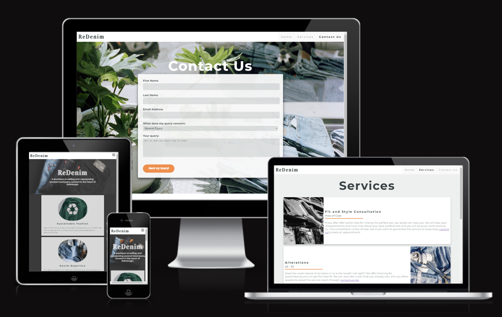

This website has been built for fictionary Denim store ReDenim, selling second hand jeans located in Edinburgh Scotland. The site provides information about the stores, services, their ideology and ways to contact them. The website was designed to cater towards an audience with interest in sustainable fashion, recycling, upcycling, vintage and styling services. 

The sites purpose is to attract potential customer for a visit or to reach out as the store does not have online platform for selling their items but is specialised in providing tailored service at store. 

## Features 

### Navigation Bar
  - A navigation panel is fixed on the top of the view port on all sites.
  - Each of the navigation panel items is linked to the page with the corresponding name. 
  - The selected page is on bold on the navigation menu.
  - On smaller screensizes the menu collapses to drop downmenu. 
  - Navigation panel allows the user to easily navigate from page to page across all devices.

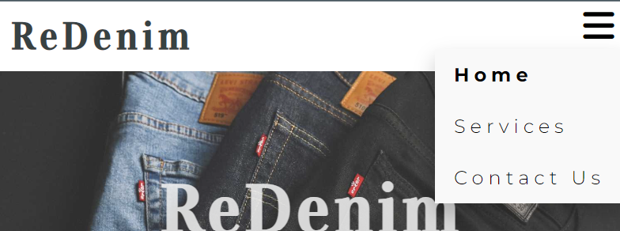
  
  *Mobile Navigation Bar*
  
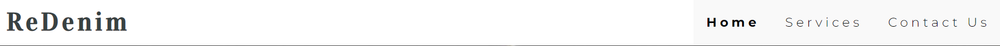

  *Desktop Navigation Bar*

### Footer

  - Footer is fixed on the bottom of each page they contain the address, opening time and social media icons acting as link to the ReDenims social media accounts. 
  - Clicking the social media icons will open a new tab for Instagram or facebook front pages. 
  - Footer layoute changes depending on the screensize.

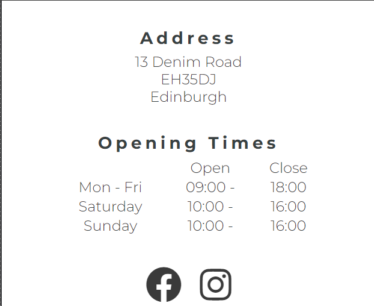
  
  *Mobile Footer*
  
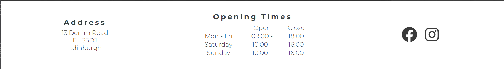

  *Desktop Footer*

### Home Page

  - Home page contains an introduction statement and image as well as description of what ReDenim does.
  - Introduction statment and images set the mood for the page and briefly introduce visitor for the store.  
  - Second part of the home page describes in more detail what the store offers and narrows this down into three sections that have been separated on to their own "cards". 
  - Each card has a topic appropriate image and a brief description of the topic.
  - Services card has a hyperlink to the services page for seamless transition.

  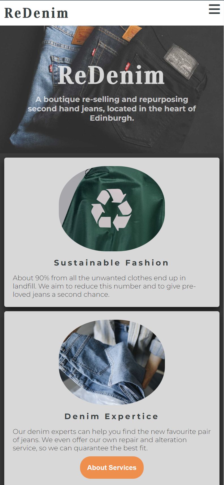 
  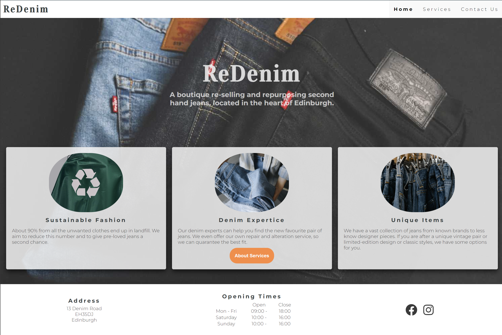

  *Services on mobile and desktop*

### Service Page

 - On this page reader can find information about services offered. All services, 4 in total, have a description "card" detailing the all the information to the reader.
 - On each card there is an image giving the viewer a hint of the content before reading the text. 
 - The of cost of the service is stated on the card right after the title. 
 - A hyperlink is embedded into each one of the service texts, providing an easy and seamless access to the page with the query form in case viewer has any questions.

  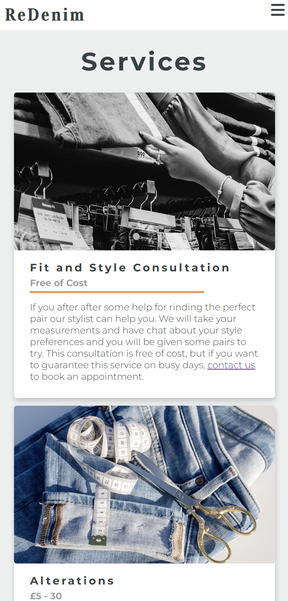
  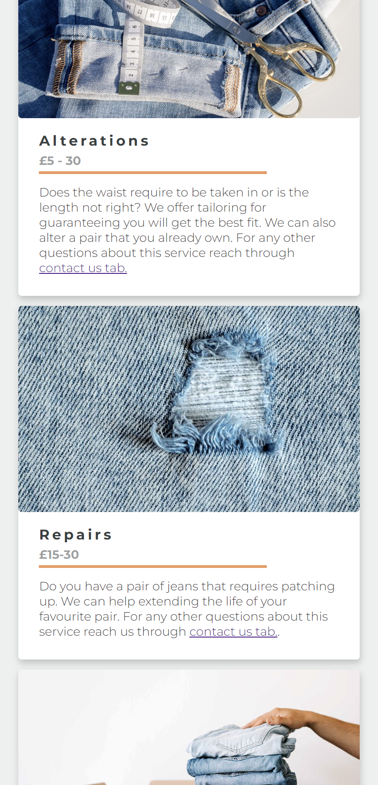
  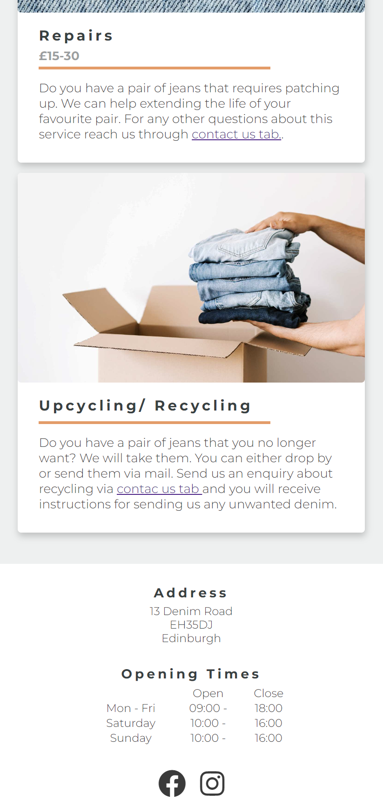
  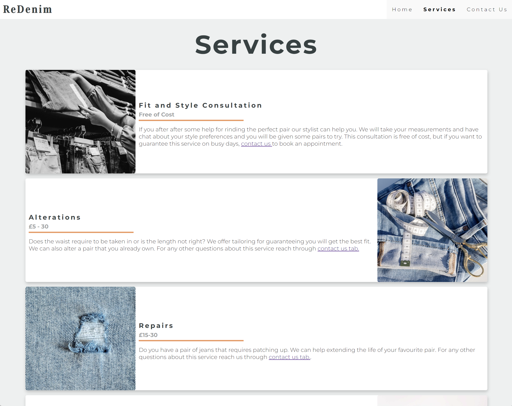

  *Services on mobile and desktop*

### Contact Us Page 

  - This page offers an easy to fill form for the visitor incase they want to contact the store.
  - This query form requires first name, second name, email, purpose of the query which is a dropdown menu, a text field for writing free text and a submit button stating “Submit”.  
  - All the fields apart from the textfield require an entry before the query can be sent. If a required field is not filled an error message on the field will occure requesting the field to be filled. 
  - If the field is selected the border will turn orange indicating for the viewer which box is selected.
  - The dropdown menu with the purpose of the query has 4 options: General, Repair and Tailoring, Fit and Style consultation and Donation and Recycling. 
  - Once the form has been completed and sent the form will be replaced with a message informing of successful submission and a return button that will allow you to return to the submission page. 

  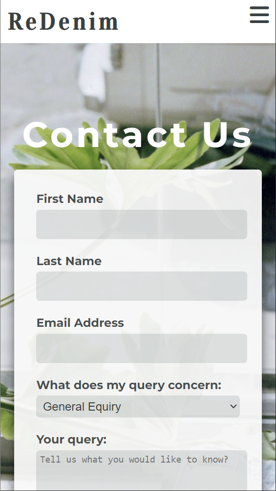
  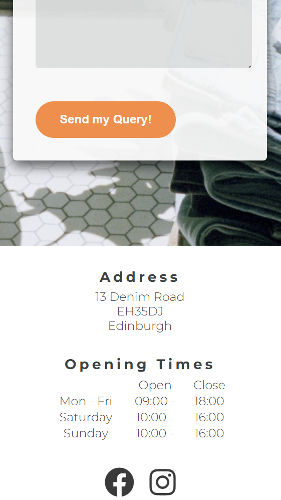
  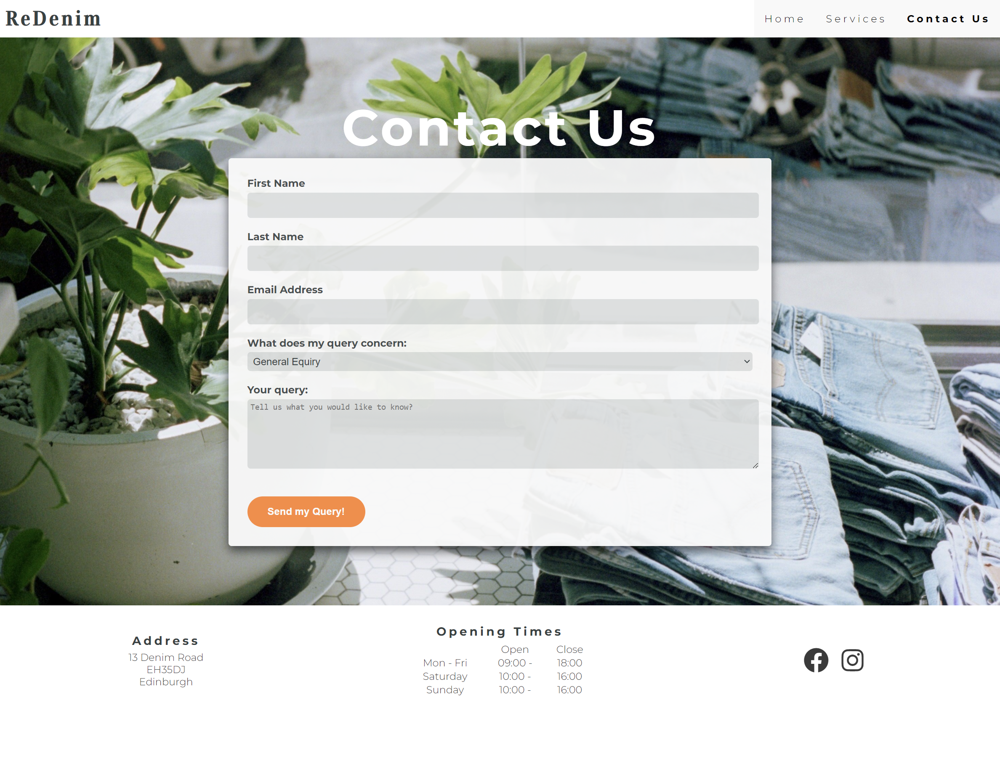

  *Contact form on mobile and desktop*

  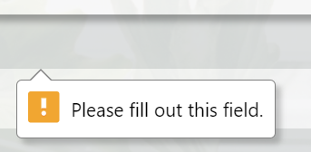
  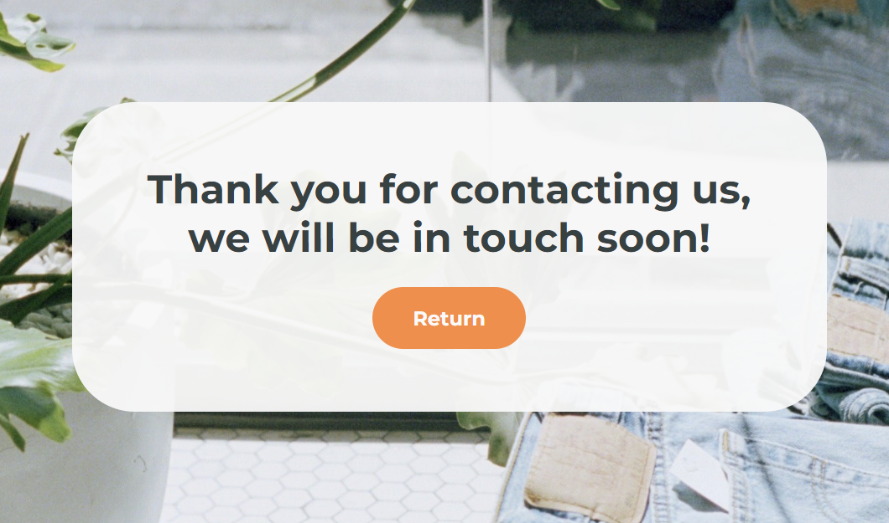

  *Contact form on validation message and the message after succesfull submission*

### Features Left to Implement

- Page for explaining teh history of denim and jeans.
- A page with a quide for finding the best fit for the jeans.

## Testing 

- Responsiveness was tested on chrome developer tools ensuring all information was easy to view in all screensizes.
- HTML code was tested usign the W3C [HTML validator](https://validator.w3.org/).
- The CSS code was tested using the W3C [CSS validator](https://jigsaw.w3.org/css-validator/).
- 
### Validator Tool Results
The deployed sites URL was fed to the validator to test sites the HTML and CSS compliance to the W3C standards.

**1st Validation** 

No errors were found from CSS.
1 error was found from HTML.
As a result the button element was removed around the <a> element in *index.html* and button style was implemented on it.

  

**2nd validation**

Both CSS and HTML passed.

    
    

## Deployment
- The site was deployed on Github Pages.
- Following steps were taken:
  1. In the project's GitHub repository, navigate to the Settings tab.
  2. On the **Source** section *Deploy from a branch* must be selected.
  3. On the **Branch** section the two dropdowns have to be set to *main* and */docs*.
  4. Once the above settings are set click *save* on the **Branch** section and wait for GitHub to deploy the page.

## Credits 

 - Gitpod and VSCode were the IDEs used to during this project.
 - Github was the repository for the files during the process and currently the storage for the finalized code. 
 - Coding Institute’s [Love Running Walkthrough Project](https://github.com/Code-Institute-Org/love-running-2.0) was a source for inspiration particularly when drafting the form for queries. 
 - Googles Developer Tool was used to test the webpage on different screen sizes and to troubleshoot any issues while building the website. 
 - W3 website was used as supporting material for the development of the site.

## Content
 - [Am I Responsive](https://ui.dev/amiresponsive) used to produce the image of webpage on different viewports.
 - [MyColorSpace](https://mycolor.space/) used to find complementary colors for the webpage.
 - [FontJoy](https://fontjoy.com/) used to find complementary fonts that I then used to create importable link in [Google Fonts](https://fonts.google.com/).
 - The icons used in this project were taken from [Font Awesome](https://fontawesome.com/)

## Media
 - Images are stock photos downloaded from [Pexels](https://www.pexels.com/), [Unspalsh](https://unsplash.com/) and [Pixbay](https://pixabay.com/). 
